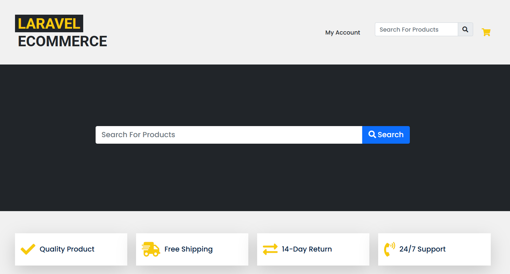
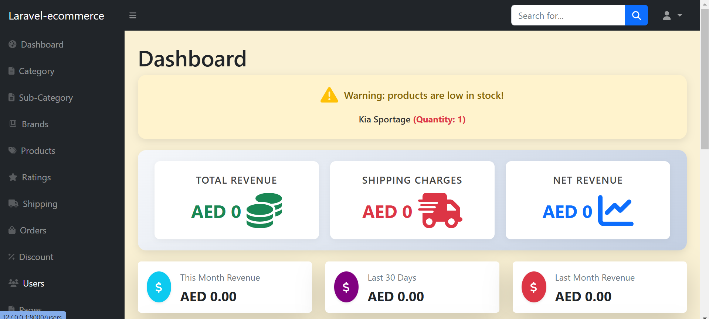
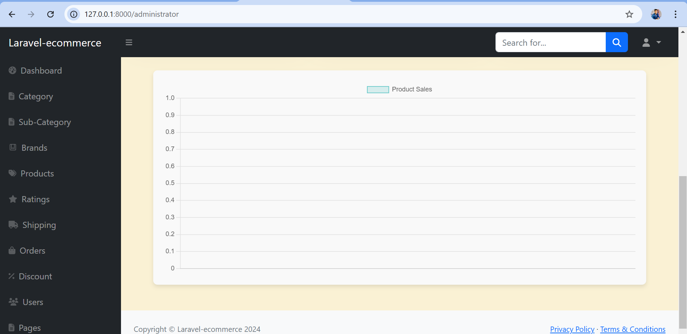
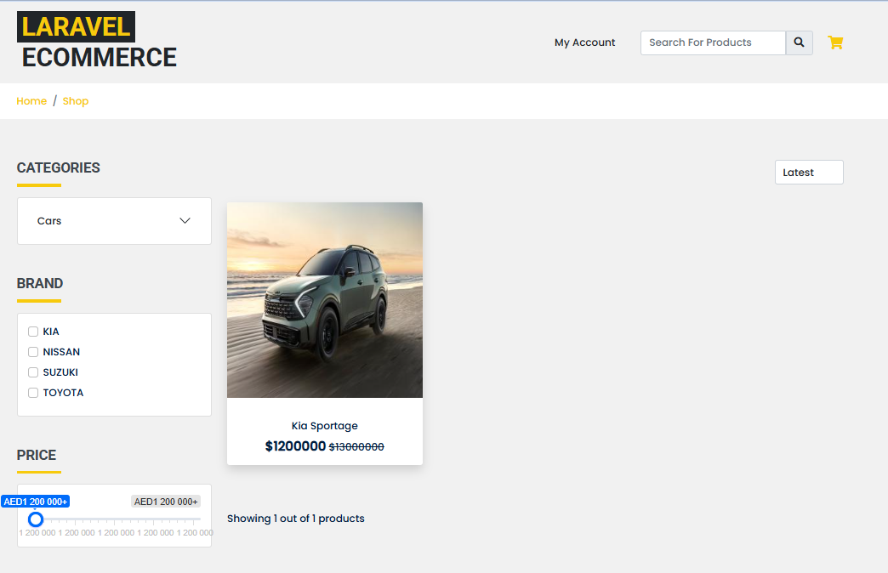
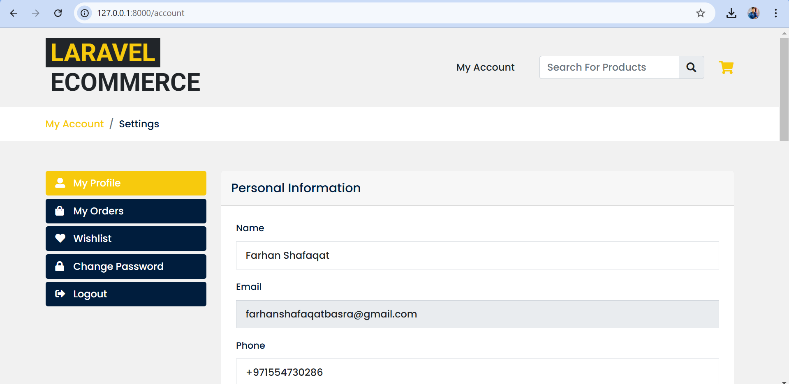
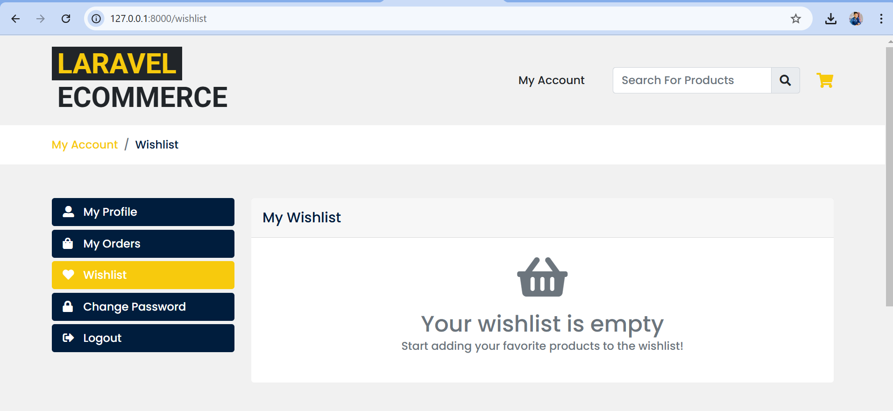

# Laravel E-Commerce Store

A fully functional eCommerce platform built with Laravel, featuring product management, user authentication, shopping cart, and checkout functionality. This project is designed to provide a robust and scalable solution for online stores.

---

### Features

- **User Authentication:** Secure registration, login, and profile management.
- **Admin Dashboard:** Manage products, orders, and users with ease.
- **Product Management:** Add, edit, and delete products with categories and tags.
- **Shopping Cart:** Add products, update quantities, and remove items.
- **Checkout Process:** Secure checkout with order summary and payment integration.
- **Order Management:** Track and manage orders from the admin panel.
- **API Support:** RESTful API for integration with mobile apps or third-party services.

---

### Installation

Follow these steps to set up the project locally:

#### 1. Clone the Repository

```bash
git clone https://github.com/faribasra6/laravel-ecommerce.git
cd laravel-ecommerce
```

#### 2. Install Dependencies
Install PHP dependencies using Composer and JavaScript dependencies using npm:
```bash
composer install
npm install && npm run dev
```
#### 3. Set Up Environment File
Copy the `.env.example` file to `.env` and update the necessary environment variables:
```bash
cp .env.example .env
```
Update the following variables in the `.env` file:

- `DB_DATABASE`: Set the name of your database.
- `DB_USERNAME`: Set the database username.
- `DB_PASSWORD`: Set the database password.
- `MAIL_*`: Configure the email settings, including `MAIL_HOST`, `MAIL_PORT`, `MAIL_USERNAME`, `MAIL_PASSWORD`, and `MAIL_ENCRYPTION`.

#### 5. Run Migrations and Seed Database
Run the migrations to create the database tables and seed the database with sample data:
```bash
php artisan migrate --seed
```
#### 6. Create Storage Symlink
Create a symbolic link for the storage directory:
```bash
php artisan storage:link
```
#### 7. Start the Development Server
Start the Laravel development server:
```bash
php artisan serve
```
Your application should now be running at ```http://127.0.0.1:8000```.

---
### Admin Panel Access

Default admin credentials (if seeded):

- **URL:** [http://127.0.0.1:8000/administrator](http://127.0.0.1:8000/administrator)
- **Email:** `your eamil`
- **Password:** `your password`

 ### Grant Admin Privileges

To make a user an admin, update the `usertype` column in the `users` table to `1` for the desired user.

---

### Screenshots

Here are some screenshots of the project:


- **Home Page:** Home Page showcasing featured products.


- **Admin Panel:** Admin Panel for managing products, orders, and users.


- **Shop Page:** Shop Page showcasing all products.

- **User Profile Page:**

- **Wishlist Page:**



---
### Additional Commands

- **Clear Cache:**

```bash
php artisan cache:clear
```
- **Refresh Migrations:**
```bash
php artisan migrate:fresh --seed
```
---

### Contributing

If you'd like to contribute to this project, please follow these steps:

1. **Fork the repository.**
2. **Create a new branch** for your feature or bugfix.
3. **Commit your changes** and push to the branch.
4. **Submit a pull request.**

---
### Reach Out

If you find any issues, have suggestions, or need assistance, feel free to reach out! I'm also open to collaboration or job opportunities.

- **Email:** [farhanshafaqatbasra@gmail.com](mailto:farhanshafaqatbasra@gmail.com)
- **LinkedIn:** [Farhan Shafaqat](https://www.linkedin.com/in/farhanshafaqat/)
- **GitHub:** [faribasra6](https://github.com/faribasra6)

---
### License

This project is open-source and available under the MIT License.

- **Repository Link:** [Laravel E-Commerce Store](https://github.com/faribasra6/laravel-ecommerce)


